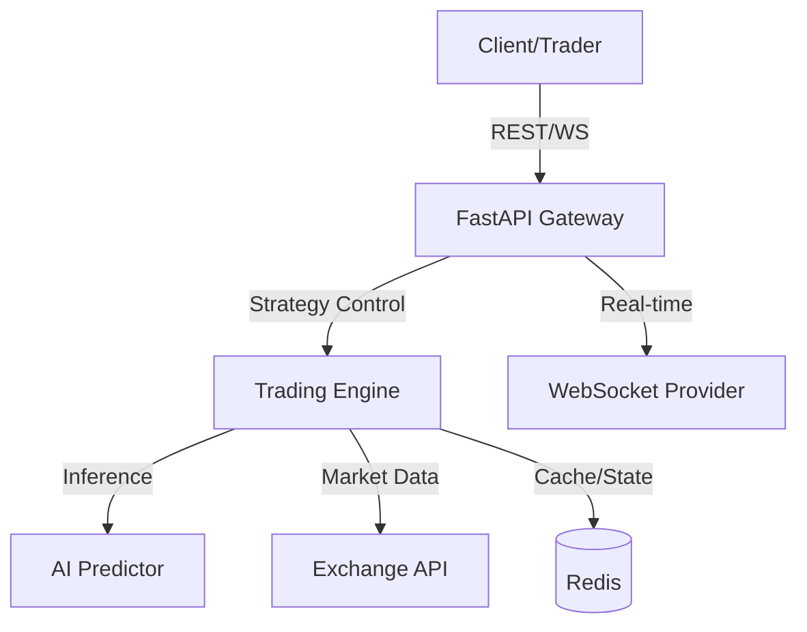

# AI Quant Trading Backend

A professional-grade backend for AI-driven quantitative trading, built with FastAPI, Redis, and Python.

## Architecture



## Features

- **Asynchronous Trading Engine**: Efficiently manages multiple trading strategies concurrently.
- **RESTful API**: Manage strategy lifecycle (start/stop/status).
- **WebSocket Streaming**: Real-time price updates for subscribed symbols.
- **AI-Powered Predictions**: Integrated mock model for price forecasting (extensible to LSTM/Transformer models).
- **Containerized**: Fully Dockerized environment with Redis integration.

## Setup Instructions

### Prerequisites
- Docker & Docker Compose
- Python 3.11+ (for local development)

### Running with Docker
```bash
docker-compose up --build
```

### Local Development
1. Install dependencies:
   ```bash
   pip install -r requirements.txt
   ```
2. Run the server:
   ```bash
   uvicorn app.main:app --reload
   ```

## API Endpoints

- `GET /`: Health check.
- `POST /api/v1/start`: Start a strategy for a given symbol.
- `POST /api/v1/stop`: Stop an active strategy.
- `GET /api/v1/status`: List all active strategies.
- `WS /ws/prices/{symbol}`: Live price stream.

## Tech Stack
- **Framework**: FastAPI
- **Real-time**: WebSockets
- **Market Data**: CCXT
- **Data Analysis**: Pandas
- **Storage**: Redis
- **Containerization**: Docker
